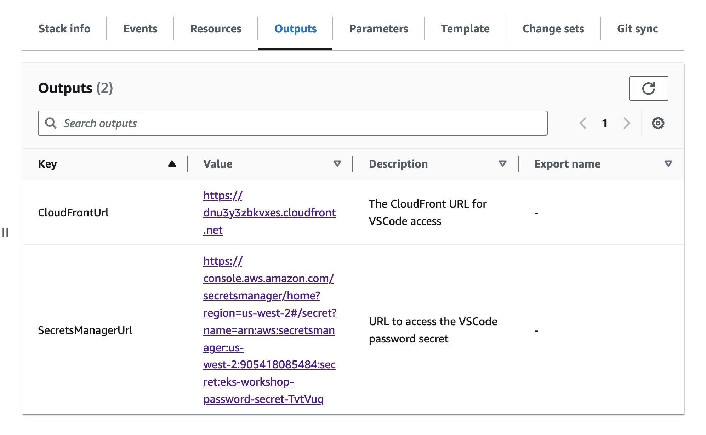

# Cloud Based VSCode IDE (Code-server) Setup via CloudFormation & Terraform

This repository contains cloudformation  & terraform templates to quickly set up VSCode (code-server) instances in the AWS environment in the `us-west-2` region. These instances are pre-configured with necessary permissions and are ready to be used for cloud security related workshops or development.

> Authored by Anjali singh Shukla & Divyanshu Shukls

> As cloud9 is deprecated, for labs and learning this script has been created.

---

## Quick-Launch Links for Cloud9 (us-east-1) and VSCode (us-west-2)

> [eksworkshop credit](https://www.eksworkshop.com/docs/introduction/setup/your-account/)

> 
Use the AWS CloudFormation quick-create links below to launch the desired environment in your preferred AWS region.

| Region         | Cloud9 (Not Recommended)                         | VSCode            |
|----------------|-------------------------------------|---------------------------------------|
| **us-east-1**  | [Launch](https://console.aws.amazon.com/cloudformation/home?region=us-east-1#/stacks/quickcreate?stackName=securitydojo-eks-workshop&templateURL=https://cf-templates-p4sqzd2p5kud-us-east-1.s3.amazonaws.com/cloud9.yaml)  | XX  |
| **us-west-2**  | XX | [Launch](https://console.aws.amazon.com/cloudformation/home?region=us-west-2#/stacks/quickcreate?stackName=securitydojo-eks-workshop&templateURL=https://cf-templates-p4sqzd2p5kud-us-east-1.s3.amazonaws.com/kubernetesvillage-workshop.yaml) |

- <b>Note: Use VSCode link in `us-west-2` for deploying code-server (VSCode IDE).</b>

### Setup Instructions

1. **Choose your Region**: Use the table above to pick your region (e.g., **us-east-1** or **us-west-2**) and launch the CloudFormation stack for Cloud9 (Not Recommended) or VSCode .
   
2. **Monitor the Stack Creation**: The stack will take about 10 minutes to complete.

3. **Accessing the Environment**: Once the stack creation is complete, you can retrieve the Cloud9 or VSCode URL using the following command.
   
   > Replace `Cloud9Url` with `VSCodeUrl` for VSCode instance.
   
   - For cloud9 (Not Recommended)

    ```bash
    aws cloudformation describe-stacks --stack-name securitydojo-eks-workshop --query 'Stacks[0].Outputs[?OutputKey==`Cloud9Url`].OutputValue' --output text --region us-east-1
    ```
   - For VSCodeUrl (Recommended)

    ```bash
     aws cloudformation describe-stacks --stack-name securitydojo-eks-workshop --query 'Stacks[0].Outputs[?OutputKey==`IdeUrl`].OutputValue' --output text --region us-west-2
    ```

4. Access the cloudformation `Outputs`.

    - CloudFrontUrl
        - To access the cloudFront url for the VSCode access
    - SecretsManagerUrl
        - Retrieve the secret to access the VSCode IDE.


    
5. Access the `CloudFrontUrl` & follow next steps from [terraform-eks](https://github.com/kubernetesvillage/terraform-eks) to deploy `eks cluster`.

### Cleanup

To avoid unnecessary costs, be sure to delete the CloudFormation stacks and any created AWS resources once you're finished.

- To delete the Cloud9 or VSCode instance, run the following command:

    ```bash
    aws cloudformation delete-stack --stack-name securitydojo-eks-workshop
    ```

- Follow the cleanup instructions for the EKS resources, either through `eksctl` or Terraform.

---

## Vscode (code-server) Quick-Launch via Terraform

### Prerequisites

Before running the `terraform apply`, ensure that the following tools are installed on your system:

- Git
- AWS CLI
- Terraform

#### Install Git

##### Ubuntu/Debian

```bash
sudo apt update
sudo apt install -y git
```

##### Amazon Linux 2

```bash
sudo yum install -y git
```

##### CentOS/RHEL

```bash
sudo yum install -y git
```

### Install AWS CLI and Terraform

These tools will be installed automatically by the `pre-deploy.sh` script if they are not already installed on your system.


### Deployment


- Access the github codespace to run the terraform code.

    - Refer to [Codespace setup](https://ekssecurity.kubernetesvillage.com/basics/gh_deploy) for detailed step by step guide along with AWS IAM user creation.


- Run the `pre-deploy.sh` to install binaries required for deploying infrastructure via terraform

```bash
source pre-deploy.sh
```


- Setup aws cli and configure admin user's credentials

> Make sure credentials have `Administrator Access` and region is `us-west-2`.

```
aws configure
```

- Run the `terraform init` to initialise the terraform.

```bash
terraform init
```

- Apply terraform to deploy the code-server.

```bash
terraform apply --auto-approve
```
> Note: Currently supported region is 'us-west-2'.

- Open the cloudfront url (https) in the browser along with `secret manager url` to access the vscode and enter the password retrieved via AWS Secret Manager.


#### Setup on Your Own Terminal

> Currently, troubleshooting on your own terminal is not supported.

1. **Clone the Repository**

    ```bash
    git clone https://github.com/kubernetesvillage/CloudBasedIDE
    cd CloudBasedIDE/terraform
    ```

2. **Pre-Deployment**

   > Run the pre-deploy.sh script to ensure all necessary dependencies (AWS CLI, Terraform, etc.) are installed.
   ```bash
    source pre-deploy.sh
    ```
3. **Configure AWS CLI**

    > Ensure that the AWS CLI is configured with the `Administrator Access` to deploy code-server (VSCode IDE).

    ```bash
    aws configure
    ```

4. **Deploy terraform**

    > Ensure that the AWS CLI is configured with the `Administrator Access` to deploy code-server (VSCode IDE).

    ```bash
    terraform init

    terraform apply --auto-approve
    ```


#### Cleanup

- Destroy infrastructure via `terraform destroy`.

```bash
terraform destroy --auto-approve
```
---


## Disclaimer

- The views expressed are solely those of the speaker and do not reflect the opinions of the employer. Use at your own risk.
- The password is temporary and regenerates each time the script runs.
- Do not push this code while the VS Code server is running.
- The author is not responsible for any charges or security issues that may arise. This is shared under the MIT 0 license. 

## License

- This project is licensed under the MIT License. See the [LICENSE](LICENSE) file for details.
- This repository uses code from the [AWS EKS Workshop](https://github.com/aws-samples/eks-workshop-v2/), licensed under the Apache-2.0.

## Credits


- The CloudFormation templates have been adapted for use in the **peachycloudsecurity** EKS workshop.
- [AWS-Samples](https://github.com/aws-samples/eks-workshop-v2/) under the [Apache-2.0 license](https://github.com/aws-samples/eks-workshop-v2/?tab=Apache-2.0-1-ov-file#readme)
- Thanks to [coder team](https://github.com/coder/deploy-code-server)
- Thanks to [AWS eks-workshop-v2](https://github.com/aws-samples/eks-workshop-v2/blob/main/lab/scripts/installer.sh)


This project is maintained by the Kubernetes Village team. Contributions are welcome!

For more information, visit our [GitHub page](https://github.com/kubernetesvillage).


## Follow us:

- [Kubernetes Village](https://www.linkedin.com/company/kubernetesvillage/)
- [Anjali Shukla](https://linktr.ee/theshukladuo)
- [Divyanshu Shukla](https://linktr.ee/theshukladuo)
